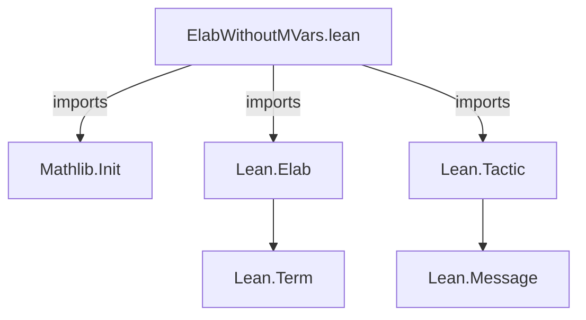
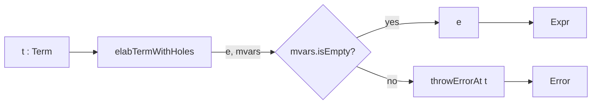

**Technical Brief: `ElabWithoutMVars.lean`**

---

### 1. KEY DEFINITIONS & THEOREMS

| Name | Type | Purpose |
|------|------|---------|
| `elabTermWithoutNewMVars` | `Name → Term → TacticM Expr` | Elaborates a `Term` using `elabTermWithHoles`, ensuring the result contains **no metavariables**; throws an error if metavariables remain. Uses `errToSorry = false` via `Term.withoutErrToSorry`. |

---

### 2. NAMING CONVENTIONS

- **Prefixes**:  
  - `elabTermWithoutNewMVars`: descriptive, action-oriented (`elabTerm_`), with qualifier `WithoutNewMVars` indicating constraint.
- **No suffix conventions** observed (e.g., no `_def`, `_thm`, `_prop`).
- **Tactic name parameter**: generic `tactic : Name`, used in error messages.

---

### 3. TACTIC STACK

| Tactic / Function | Role |
|-------------------|------|
| `Term.withoutErrToSorry` | Wraps elaboration to disable `errToSorry` (i.e., errors are not converted to `sorry`). |
| `elabTermWithHoles` | Core elaborator that returns `(Expr × MVarIdSet)`. |
| `unless ... do` | Conditional control flow: fails if `mvars.isEmpty` is false. |
| `throwErrorAt` | Reports user-facing error at source location `t`. |
| `indentD` | Pretty-prints expression with indentation for readability. |

No high-level tactics (`aesop`, `ring`, `simp`, etc.) used — purely low-level elaborator combinators.

---

### 4. PROOF LOGIC

- **Structure**:  
  1. Wrap elaboration in `Term.withoutErrToSorry` to enforce strict error handling.  
  2. Call `elabTermWithHoles` to get elaborated expression `e` and metavariable set `mvars`.  
  3. Check `mvars.isEmpty`; if not empty, throw error with location and pretty-printed term.  
  4. Return `e` if clean.

- **Logical flow**:  
  > *Elaborate → Extract metavariables → Validate emptiness → Return or fail.*

No induction, case analysis, or classical reasoning involved — purely syntactic elaboration-time validation.

---

### 5. IMPORTS

| Module | Purpose |
|--------|---------|
| `Mathlib.Init` | Provides foundational Lean types, monads, and utilities (e.g., `TacticM`, `Term`, `Expr`, `Name`, `MVarIdSet`). |
| `Lean.Elab` | Elaboration monad and combinators (`elabTermWithHoles`, `Term.withoutErrToSorry`). |
| `Lean.Tactic` | Tactic infrastructure (`throwErrorAt`, `indentD`). |

> **Scope**: This module is part of Lean’s *elaboration infrastructure*, likely used in custom tactic development where *well-formedness* (no unresolved metavariables) is required.

---

### 6. DEPENDENCY & OVERVIEW DIAGRAMS

#### Module Dependency Graph (Mermaid)

#### File Overview (Mermaid)

---

### 7. CONTEXTUAL ROLE

- **Purpose**: A utility for *tactic authors* to safely elaborate user-provided terms, rejecting those with unresolved holes (metavariables).
- **Use case**: Ensures arguments to critical tactics (e.g., `by_cases`, `induction`, custom automation) are fully elaborated and closed — preventing silent `sorry`-like behavior or unsound assumptions.
- **Relation to theory**: Part of Lean’s *metaprogramming safety layer*, enforcing *well-typedness* and *completeness* at elaboration time.

--- 

Let me know if you'd like formalization of correctness properties (e.g., soundness of `elabTermWithoutNewMVars`) or integration examples.
