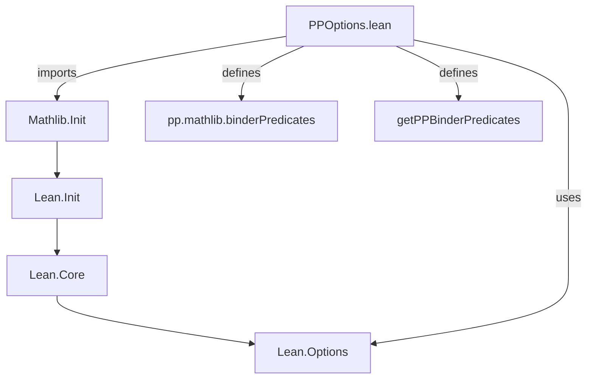
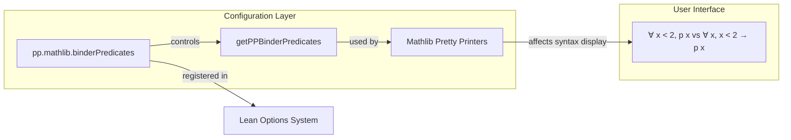

**Technical Brief: `PPOptions.lean`**

---

### 1. **Key Definitions & Theorems**

| Name | Type | Purpose |
|------|------|---------|
| `pp.mathlib.binderPredicates` | `Option Bool` (registered via `register_option`) | A Lean pretty-printer option controlling whether mathlib pretty printers use *binder predicate notation* (e.g., `∀ x < 2, p x` instead of `∀ (x : α), x < 2 → p x`). |
| `getPPBinderPredicates` | `Options → Bool` | Helper function to retrieve the current value of `pp.mathlib.binderPredicates`, defaulting to `¬ getPPAll o` (i.e., `false` if global pretty-printing is disabled). |

---

### 2. **Naming Conventions**

- **Option names**: Use dot-separated hierarchical naming (`pp.mathlib.binderPredicates`) — consistent with Lean’s `register_option` convention.
- **Prefixes**:
  - `pp.` — indicates *pretty-printer* options.
  - `getPP*` — getter functions for pretty-printer options (`getPPBinderPredicates`, presumably `getPPAll` from `Lean` core).
- **Suffixes**:
  - `Predicates` — indicates logical predicate-style binder syntax (as opposed to function-style).

---

### 3. **Tactic Stack**

- **No tactics used** in this file.  
  This is a *purely metaprogramming* module: it defines options and a pure function, with no proof or tactic scripts.

---

### 4. **Proof Logic**

- **Not applicable** — this file contains no theorems or proofs.  
  It is a *configuration module* for pretty-printing behavior.

---

### 5. **Imports**

| Import | Role |
|--------|------|
| `Mathlib.Init` | Provides foundational definitions; includes `Lean` core and `register_option` infrastructure. |
| `Lean` (via `open Lean`) | Needed for `Options`, `name`, and `getPPAll`. |

---

### 8. **Mermaid Diagrams**

#### **Dependency Graph**

#### **Overview of Module Scope**

---

**Summary**:  
`PPOptions.lean` is a minimal, metaprogramming-only module that registers and exposes a single pretty-printer configuration flag (`pp.mathlib.binderPredicates`) for controlling binder syntax in mathlib. It follows Lean’s standard option registration pattern and integrates with the global pretty-printing infrastructure (`getPPAll`). No proofs or tactics are involved — it is purely a *configuration interface*.
