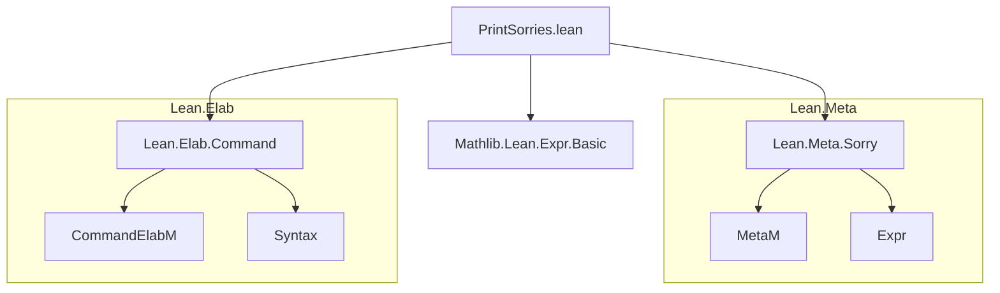
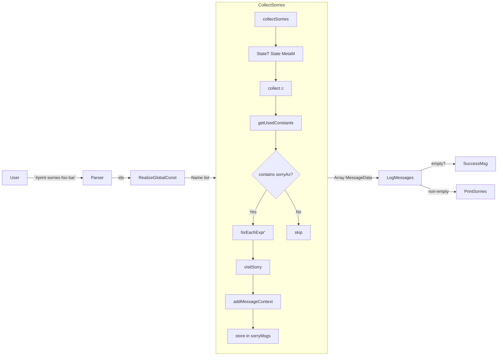

### Technical Brief: `PrintSorries.lean`

---

#### **1. Key Definitions & Theorems**

| Name | Type / Signature | Purpose |
|------|------------------|---------|
| `State` | `structure` | Tracks intermediate computation for sorry-tracking: `visited : NameSet`, `sorries : Std.HashSet Expr`, `sorryMsgs : Array MessageData`. |
| `collect` | `Name → StateT State MetaM Unit` | Recursively collects all uses of `sorry` (via `sorryAx`) in a declaration and its transitive dependencies. Uses `getUsedConstants` for efficiency. |
| `collectExpr` | `Expr → StateT State MetaM Unit` | Helper inside `collect`: visits expressions, checks for `sorryAx`, and records `sorry` occurrences. |
| `visitSorry` | `Expr → StateT State MetaM Unit` | Records a `sorry` occurrence as a message, including type info and whether it's synthetic (from an error). |
| `collectSorries` | `Array Name → MetaM (Array MessageData)` | Runs `collect` over a list of declarations and returns all collected sorry messages. |
| `evalCollectSorries` | `Array Name → CommandElabM Unit` | Logs collected sorry messages (or success message if none). |
| `#print sorries` | Command syntax & elaborator | Main user-facing command: prints all `sorry`s used (directly or transitively) by given declarations or current module. |

---

#### **2. Naming Conventions**

- **Prefixes**:
  - `collect*`: Functions that traverse declarations/expressions to gather data (`collect`, `collectExpr`, `visitSorry`).
  - `eval*`: Elaborator/execution functions (`evalCollectSorries`).
- **Suffixes**:
  - `*Msgs`: Arrays of `MessageData` (`sorryMsgs`).
  - `*Expr`: Functions operating on `Expr`s (`collectExpr`, `visitSorry`).
- **Constants**:
  - `` ``sorryAx`` ``: The internal constant representing `sorry`.
  - `isSyntheticSorry`, `isSorry`, `isLabeledSorry?`: Predicate helpers for `sorry` detection.

---

#### **3. Tactic Stack**

- **Core tactics & utilities**:
  - `getUsedConstants`: Efficiently extracts constants used in an expression.
  - `forEachExpr'`: Traverses subexpressions (with caching).
  - `getBoundedAppFn`, `getAppNumArgs`: For extracting the `sorry` function from an application.
  - `modify`, `get`, `liftTermElabM`, `liftCoreM`: Standard `StateT`, `MetaM`, `CommandElabM` operations.
  - `isBlackListed`: Filters out internal/built-in names.

No high-level tactics like `simp`, `rw`, or `linarith` are used—this is purely a *meta-level* analysis tool.

---

#### **4. Proof Logic / Execution Flow**

- **Top-level command parsing**:
  - Parses `#print sorries [ids]` or `#print sorries in CMD`.
  - For `#print sorries`, collects all non-blacklisted constants in the current environment.
  - For `#print sorries in CMD`, compares environment before/after `elabCommand` to find newly added declarations.

- **Core algorithm (`collect`)**:
  1. Uses `visited` set to avoid re-processing declarations (prevents infinite loops).
  2. For each declaration:
     - Extracts its type and value (if applicable).
     - Uses `getUsedConstants` to find constants used in the declaration.
     - Recursively calls `collect` on each constant.
     - If `sorryAx` is found in the constants, uses `forEachExpr'` to locate *actual* `sorry` subterms.
  3. For each `sorry` term found:
     - Checks if already recorded in `sorries` set (to avoid duplicates).
     - Builds a message with declaration name, term, optional type, and synthetic/error flag.
     - Adds to `sorryMsgs`.

- **Message formatting**:
  - Includes hoverable/“go to definition” support via `addMessageContext`.
  - Synthetic sorries (from errors) are marked explicitly.

---

#### **5. Imports**

| Import | Role |
|--------|------|
| `Mathlib.Lean.Expr.Basic` | Basic expression utilities (likely for `isSyntheticSorry`, etc.). |
| `Lean.Elab.Command` | Command elaboration infrastructure (`elab_rules`, `CommandElabM`). |
| `Lean.Meta.Sorry` | Meta-level support for `sorry`, including `isSorry`, `isLabeledSorry?`, `inferType`. |

---

#### **8. Mermaid Diagrams**

##### **Dependency Graph (Module-Level)**

##### **Data Flow Diagram (Command Execution)**

##### **Overview of Theory Scope**

This file implements a *static analysis tool* for Lean 4, focused on:
- **Dependency tracking** of `sorry` (via `sorryAx`) across declarations.
- **Non-invasive reporting**: avoids modifying the kernel or environment.
- **User feedback**: messages are context-aware and IDE-integrated (hoverable, go-to-def).

It does **not**:
- Prove properties about `sorry` usage.
- Generalize to other axioms (by design, per TODO).
- Introduce new logic—purely meta-level introspection.

It sits at the intersection of:
- **Lean metaprogramming** (`MetaM`, `CommandElabM`)
- **Compiler/IDE tooling** (environment inspection, message generation)
- **Formal verification hygiene** (detecting incomplete proofs)

--- 

Let me know if you'd like a formalized spec of `collect` or a tactic version of `#print sorries`.
