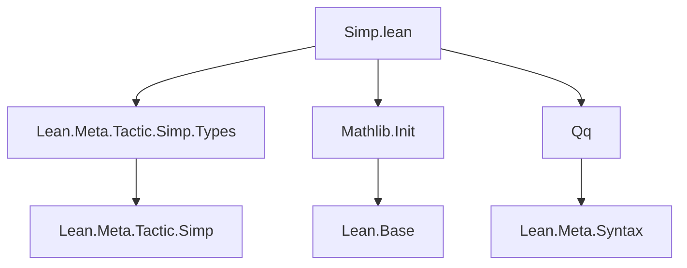

**Technical Brief: `Simp.lean` (Lean 4)**

---

### 1. **Key Definitions & Theorems**

| Name | Type | Purpose |
|------|------|---------|
| `Methods.dischargeQ?` | `Methods → Q(Prop) → SimpM (Option Q($a))` | A metaprogramming utility that wraps `Methods.discharge?` to work directly with `Qq`-quoted propositions, returning a quoted proof if successful. Avoids manual `~q`-matching on the result of `discharge?`. |

> **Note**: No theorems are stated; this is a *metaprogramming helper* for `simp`-related tactics.

---

### 2. **Naming Conventions**

- **Prefix**: `dischargeQ?` follows Lean’s convention of `?` suffix for *optional-returning* functions.
- **Suffix**: `Q?` indicates integration with `Qq` (quoted syntax) and optional result.
- **Module/namespace**: `Lean.Meta.Simp` — standard for `simp`-related metaprogramming utilities.

---

### 3. **Tactic Stack**

- **No tactics used in proofs** (this is a *definition*, not a proof script).
- **Metaprogramming stack**:
  - `SimpM` — monad for `simp`-related computations.
  - `Qq` — quoted syntax manipulation.
  - `Lean.Meta` — core metaprogramming infrastructure.

---

### 4. **Proof Logic**

- **Not applicable** — this file contains *no proofs*, only a *definition*.
- The definition is *straightforward*: it is a direct composition/wrapper:
  ```lean
  dischargeQ? M a := M.discharge? a
  ```
  (modulo type coercion via `SimpM` and `Qq`.)

---

### 5. **Imports**

| Import | Role |
|--------|------|
| `Lean.Meta.Tactic.Simp.Types` | Provides `Methods`, `SimpM`, and core `simp`-related types. |
| `Mathlib.Init` | Base Lean + Mathlib initialization (e.g., `Qq`, basic utilities). |
| `Qq` | Provides quoted syntax (`Q(·)`) and metaprogramming utilities for syntax manipulation. |

> **Scope**: This module extends `simp`’s metaprogramming interface — specifically for *discharge* operations in simplification.

---

### 6. **Mermaid Diagrams**

#### **Dependency Graph**


#### **Overview of File & Theory Context**
```mermaid
flowchart LR
  subgraph "Core Theory"
    S[Simp.lean] -->|extends| M[Lean.Meta.Simp]
    M -->|uses| D[Methods.discharge?]
    D -->|from| T[Simp.Types]
  end

  subgraph "Metaprogramming Layer"
    S -->|wraps| Q[Qq]
    Q -->|provides| Qq[Q(Prop), quoted proofs]
  end

  S -->|enables| U[Custom simp dischargers with quoted proofs]
```

---

### Summary

This file is a *minimal, focused metaprogramming utility* that bridges `Methods.discharge?` with `Qq`-quoted syntax. It enables `simp`-based tactics to obtain quoted proofs without manual `~q`-matching, improving ergonomics in tactic writing. No mathematical content — purely a *tooling layer* for the `simp` infrastructure.
