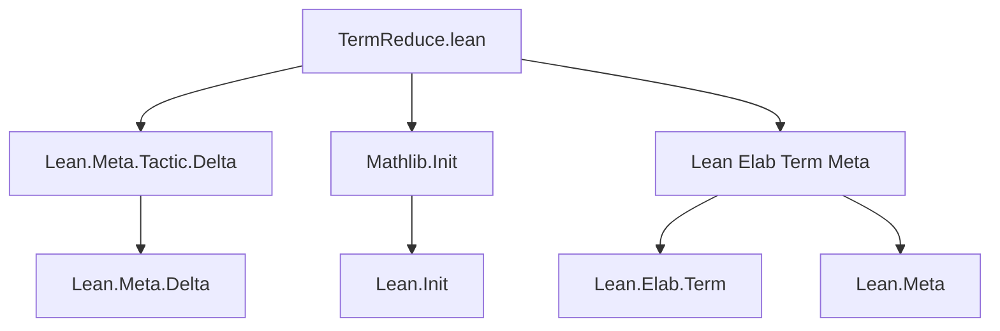
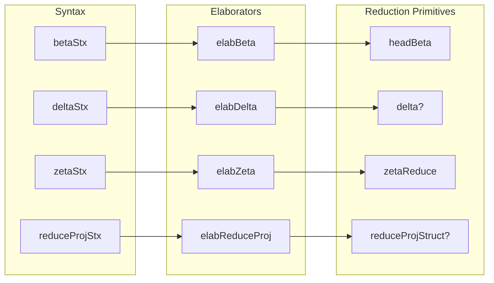

**Technical Brief: `TermReduce.lean`**

---

### 1. **Key Definitions & Theorems**

| Name | Type | Purpose |
|------|------|---------|
| `betaStx` | Syntax | Syntax declaration for `beta% t` term elaborator. |
| `elabBeta` | `TermElab` | Elaborates `t`, instantiates metavariables, and applies one-level `headBeta` reduction. |
| `deltaStx` | Syntax | Syntax declaration for `delta% t`. |
| `elabDelta` | `TermElab` | Elaborates `t`, synthesizes/synthesizes metavariables, and applies head delta-reduction via `delta?`. |
| `zetaStx` | Syntax | Syntax declaration for `zeta% t`. |
| `elabZeta` | `TermElab` | Elaborates `t`, then applies zeta-reduction (i.e., reduction of `let`/`fun` bindings) via `zetaReduce`. |
| `reduceProjStx` | Syntax | Syntax declaration for `reduceProj% t`. |
| `elabReduceProj` | `TermElab` | Elaborates `t`, then applies `Expr.reduceProjStruct?` to all subexpressions via `Lean.Core.transform`. |

> **Note**: None are theorems; all are *term elaborators* for custom reduction tactics in Lean’s elaboration pipeline.

---

### 2. **Naming Conventions**

- **Syntax names**: `betaStx`, `deltaStx`, `zetaStx`, `reduceProjStx` — suffix `Stx` indicates syntax declarations.
- **Elaborator names**: `elabBeta`, `elabDelta`, `elabZeta`, `elabReduceProj` — prefix `elab` + reduction name.
- **Reduction types**: Named after Greek letters (`beta`, `delta`, `zeta`) — standard λ-calculus reduction names.
- **`%` in syntax**: Used in `beta%`, `delta%`, etc., to distinguish from regular identifiers and indicate meta-level reduction.

---

### 3. **Tactic Stack**

Frequent tactics/operations used in the elaborators:

| Tactic / Operation | Usage |
|--------------------|-------|
| `elabTerm` | Core term elaboration. |
| `instantiateMVars` | Instantiate metavariables after elaboration. |
| `synthesizeSyntheticMVars` | Solve remaining synthetic metavariables. |
| `withSynthesize (postpone := .partial)` | Allow partial synthesis during elaboration. |
| `headBeta` | Apply one-step β-reduction on head. |
| `delta?` | Attempt head δ-reduction (unfolding definitions). |
| `zetaReduce` | Apply ζ-reduction (reduce `let`/`fun` applications). |
| `Lean.Core.transform` + `Expr.reduceProjStruct?` | Structural traversal + projection reduction. |
| `withoutExporting` | Temporarily suppress export flag during delta reduction. |
| `throwUnsupportedSyntax` | Error handling for malformed syntax. |

---

### 4. **Proof Logic / Elaboration Flow**

Each elaborator follows a consistent pattern:

1. **Parse syntax** (`match stx with | `(op $t) => ...`).
2. **Elaborate inner term** `t` with `elabTerm`.
3. **Synthesize metavariables**:
   - Use `withSynthesize (postpone := .partial)` to allow incomplete info.
   - Call `synthesizeSyntheticMVars` to resolve synthetic mvars.
4. **Instantiate remaining metavariables** via `instantiateMVars`.
5. **Apply reduction**:
   - `beta%`: `headBeta`
   - `delta%`: `delta?` (with error on failure)
   - `zeta%`: `zetaReduce`
   - `reduceProj%`: structural traversal with `reduceProjStruct?`
6. **Return reduced term**.

No induction or case analysis is used — all logic is *metaprogrammatic*, operating on `Lean.Expr` at elaboration time.

---

### 5. **Imports**

| Import | Role |
|--------|------|
| `Lean.Meta.Tactic.Delta` | Provides `delta?`, `delta` tactic internals. |
| `Mathlib.Init` | Base utilities and imports for Mathlib. |
| `Lean Elab Term Meta` | Core elaboration infrastructure: `TermElab`, `elabTerm`, `Meta`, etc. |

> **Note**: `public meta import` and `public import` indicate these are part of the public API surface for downstream modules.

---

### 6. **Mermaid Diagrams**

#### **Dependency Graph**

#### **Overview of File Structure**

---

### 7. **Theory Context**

- **Purpose**: Provide *term-level* reduction helpers for interactive theorem proving in Mathlib.
- **Use Cases**:
  - `beta%` for simplifying applications of lambdas in quantifiers (`∀ i, beta% (λx. p x i)`).
  - `delta%` to unfold definitions at term level.
  - `zeta%` to reduce `let`-bindings.
  - `reduceProj%` to simplify projections on structured types (e.g., `struct`/`class` fields).
- **Design Philosophy**: Minimal, non-recursive reductions — avoids full normalization to preserve control and performance in elaboration.

--- 

Let me know if you'd like a formalized spec of the reduction semantics or a comparison with `simp`/`norm_cast`.
